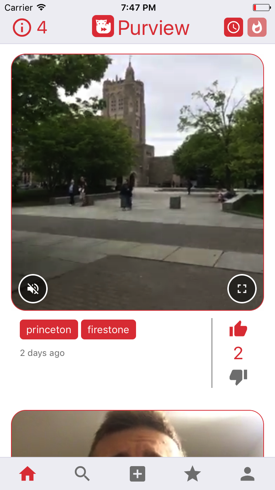
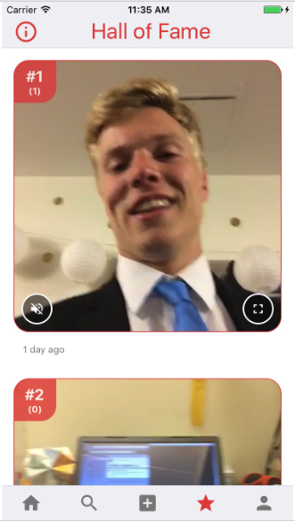

## What is Purview?

Purview is an anonymous public content-sharing platform that allows users to share short videos with everyone around them. Purview integrates the anonymous geolocation-based feed of Yik Yak, the short-video focus of Vine and an extended version of the 'Stories' feature of Snapchat to offer university students and passionate video-makers a fast and fun way to share their experiences with everyone near them. It is the first video sharing platform that allows users to not only anonymously share content, but also to quickly catch up with what is happening in their surrounding area by viewing through the eyes of their peers near them. 

A picture is worth a thousand words. And Purview allows you to share more than just a picture ... seamlessly and with everyone.

### Feature Demonstration

#### Home Feed

The video feed is comprised of a list of all videos posted within 2.5 km of your current location within the last 3 days. Here, you can interact with videos by toggling sound, expanding the view, or opening the fullscreen view. Each video comes with a number of tags that describe its content, as well as a score, which is an indicator of the community's consensus on the video's quality and relevance. Users can vote on the video by pressing either the thumbs up or thumbs down button. The feed can be sorted either by time or popularity, by pressing the button in the upper right hand corner.

#### Video Search

The second tab is the search page, where users can search for specific videos within their overall feed by tag. For example, typing ‘Princeton’ as the search query populates the feed with all nearby and recent videos with the ‘Princeton’ tag. Just as in the home page feed, users can drag down to refresh, and sort the results by either recent or popularity. In the top bar, the score indicator is replaced by a back button, which returns the user to the home page. Users interact and vote with videos as normal on this page; pressing on a tag will simply submit a new query without any redirection.

#### Posting a Video

To post a video, click on the middle tab (plus icon) within the tab bar. After camera and microphone permissions are granted, the page will immediately begin displaying the camera’s current contents . The camera can be toggled between front and back-facing by pressing the flip button in the upper right hand corner. To begin recording, press and hold the record button; a red indicator will begin filling the circle as the video approaches the maximum duration of 10s. After capturing and confirming the video,
the user can attach up to 10 tags to the video before submission.

#### Hall of Fame

The hall of fame tracks the top 10 videos of all time, ranked by overall score. Once a video expires from the normal feed after its lifetime of three days, it is placed into the hall of fame if its score is high enough. Whereas videos found in the home feed are location-based and expire after three days, videos in the hall of fame can be accessed globally, and never expire. On the hall of fame feed, videos have an extra indicator in the top left corner showing what its current overall rank is within the hall of fame.

### Milestones Timeline

 Date | Features | Status 
 --- | --- | ---
 3/24/17 | End-to-end connectivity with API | **Completed**
 | Project status site | **Completed**
 | User creation and persistence | **Completed**
 4/7/17 | Video search | **Completed**
 | Video upload | **Completed**
 4/14/17 | Prototype version | **Completed**
 | Voting system | **Completed**
 4/28/17 | Alpha phase | **Completed** 
 5/5/17 | Hall of fame | **Completed** 
| Beta phase | **Completed** 
 5/14/17 | Project complete | **Completed**

